## Grupo

| Número | Nome          |
| -------- | ------- |
| a100066 | Ricardo Miguel Queirós de Jesus |
| a100659 | Rui Pedro Fernandes Madeira Pinto |
| a100557 | Pedro Miguel Costa Azevedo |


# Índice

- [Grupo](#grupo)
- [Introdução](#1-introdução)
- [Objetivo](#2-objetivo)
- [Análise e Especificação](#3-análise-e-especificação)
  - [Descrição do problema](#31-descrição-do-problema)
  - [Levantamento de Requisitos](#32-levantamento-de-requisitos)
    - [Requisitos Funcionais](#321-requisitos-funcionais)
    - [Requisitos Extra](#322-requisitos-extra)
- [Estrutura / Desenvolvimento](#4-estrutura--desenvolvimento)
  - [API de dados](#41-api-de-dados)
    - [curjos.js](#411-curjosjs)
    - [recursos.js](#412-recursosjs)
    - [users.js](#413-usersjs)
  - [UniMaterial](#42-unimaterial)
    - [admin.js](#421-adminjs)
    - [index.js](#422-indexjs)
    - [recursos.js](#423-recursosjs)
    - [users.js](#424-usersjs)
  - [Autenticação](#43-autenticação)
- [Interface desenvolvida](#5-interface-desenvolvida)
  - [Pagina de autenticação](#51-pagina-de-autenticação)
  - [Pagina de registo](#52-pagina-de-registo)
  - [Página de notícias](#53-página-de-notícias)
  - [Página de recursos](#54-página-de-recursos)
  - [Página de publicação de um recurso](#55-página-de-publicação-de-um-recurso)
  - [Página de edição de um recurso](#56-página-de-edição-de-um-recurso)
  - [Página do painel do administrador](#57-página-do-painel-do-administrador)
  - [Página de perfil](#58-página-de-perfil)
  - [Página de edição de perfil](#59-página-de-edição-de-perfil)
- [Modo de funcionamento](#6-modo-de-funcionamento)
- [Conclusão](#7-conclusão)


# 1. Introdução 

Este relatório apresenta o trabálho prático realizado no âmbito da unidade curricular de Engenharia Web, realizado durante o 2º semestre do 3º ano do curso de Licenciatura em Engenharia Informática. 

Neste projeto, o grupo decidiu escolher a prosposta "Plataforma de Gestão e Disponibilização de Recursos Educativos" tendo sido esta, a proposta que despertou mais interesse no nosso grupo

Ao longo deste relatório, iremos falar sobre a análise e especificação, descrevendo o problema a ser resolvido e establencendo os requisitos necessários. Posteriormente, iremos detalhar a estrutura do projeto, mostrando em mais detalhe, como foi feita a organização em termos de codificação. Após isto, iremos mostrar, com auxílio de print's, a interface desenvolvida. Por fim, iremos explicar como executar o projeto e respetiva conclusão do relatório.

# 2. Objetivo

O objetivo deste projeto é criar uma plataforma que os alunos, professores, entre outros, de uma escola/universidade, possam utilizar, para fornecer recursos que possam ser visualizados pelos restantes utilizadores da plataforma.

# 3. Análise e Especificação

## 3.1 Descrição do problema

O objetivo deste trabalho é desenvolver uma plataforma a ser usada por vários utilizadores desde professores, alunos, tendo também a possibilidade de ter um administrador com controlo total sobre o resto dos utilizadores.

Os utilizadores desta plataforma têm a possibilidade de publicar os seus próprios recursos, avaliar os recursos publicados por outros utilizadores e comentar tanto os próprios recursos como os recursos publicados por outros utilizadores.

## 3.2 Levantamento de Requisitos

Durante o desenvolvimento desta plataforma, o grupo levantou diversos requisitos de forma a ajudar na orientação e desenvolvimento do projeto.

### 3.2.1 Requisitos Funcionais

Neste projeto fomos capazes de implementar todos os objetivos principais.

Cada utilizador é capaz de criar conta, criar publicações onde pode dizer o nome, tema, uma descrição e os ficheiros pretendidos.

Um utilizador é capaz de comentar e avaliar os diversos posts.

Criamos ainda um admin, capaz de fazer tudo o que faz o utilizador normal, porém tem ainda um painel de admin capaz de editar ou eliminar utilizadores, e os cursos existentes.

É também possivel dar back up dos dados, explicado mais a frente neste relatório.

### 3.2.2 Requisitos Extra

De requisitos extras adicionamos a opção de favoritos, onde um utilizador pode criar uam lista com as suas publicações favoritas.

Adicionamos também, na parte da  publicação, a opção de acesso restrito, podendo este ser público, restrito ao curso, departamento ou escola.

Na secção do perfil, cada utilizador tem uma tabela com as suas respetivas publicações.

Na aba de publicações, é possível pesquisar por autor, nome, tema, escola, departamento ou curso. É ainda possível ordenar as publicações por ordem de publicação, melhores avaliações e mais avaliações.

# 4. Estrutura / Desenvolvimento

Neste capítulo iremos falar de como o foi feita a estrutuação do projeto. Este proejto foi estruturado entre duas sub-aplicações, a API de dados e a UniMaterial(interface).
Cada uma destas partes desempenha um importante papel no funcionamento da plataforma desenvolvidoa, trabalhando de forma conjunta de forma a funcionar na totalidade. A estruturação nestas duas partes distintas, permite que o projeto seja dividido nestes dois módulos independentes, facilitando o desenvolvimento, manutenção e escalabilidade da plataforma. Neste capítulo iremos também falar sobre como funciona a autenticação.

# 4.1 API de dados

A API é estruturada em models, routes e controllers, seguindo a estrutura ensinada nas aulas práticas.

## 4.1.1 `cursos.js`

### Routes
- **GET /**: Lista todos os cursos.
- **GET /:id**: Encontra um curso pelo ID.
- **POST /**: Cria um novo curso.
- **DELETE /:id**: Remove um curso pelo ID.

## 4.1.2 `recursos.js`

### Listagem e Pesquisa
- **GET /**: Lista ou procura recursos com filtros variados como nome, autor, etc.
- **POST /**: Adiciona novos recursos.
- **POST /update/:id**: Atualiza um recurso pelo ID.
- **DELETE /:id**: Remove um recurso específico.
- **POST /:id/comentarios**: Adiciona comentários a um recurso.
- **POST /:id/avaliar**: Adiciona avaliações a um recurso.

### Autenticação e Administração
- Rotas que adicionam ou removem recursos exigem autenticação e, em alguns casos, verificação de administração.

## 4.1.3 `users.js`

### Configuração do Passport
- **LocalStrategy** usando 'email' como identificador.

### Rotas de Usuário
- **GET /**: Lista todos os usuários.
- **GET /profile/:email**: Mostra o perfil de um usuário.
- **GET /:email/favs**: Lista os favoritos de um usuário.
- **POST /login**: Autentica um usuário e retorna um token JWT.
- **POST /registo**: Registra um novo usuário.

### Gestão de Favoritos e Usuários
- **POST /favoritos/add**: Adiciona um recurso aos favoritos.
- **POST /favoritos/:recursoId/remove**: Remove um recurso dos favoritos.
- **POST /:email**: Atualiza informações de um usuário.
- **PUT /:email/cargo**: Atualiza o cargo de um usuário.
- **DELETE /delete/:userId**: Apaga um usuário.

## 4.2 UniMaterial

Na interface, lidamos principalmente com routes, views, e public folders.

### 4.2.1 `admin.js`

#### Painel Administrativo
- **GET /**: Lista usuários e cursos se o usuário for admin.

#### Gestão de Perfil e Usuários
- **GET /edit/:email**: Edita perfil de um usuário.
- **POST /perfil/:email/update**: Atualiza o perfil de um usuário.
- **POST /users/delete/:id/:email**: Elimina um usuário e seus dados associados.

### 4.2.2 `index.js`

#### Autenticação e Sessão
- **GET /**: Carrega a página de login.
- **POST /login**: Processa login.
- **GET /logout**: Encerra a sessão do usuário.

#### Registro e Gestão de Perfil
- **GET /registo** e **POST /registo**: Gerencia o registro de usuários.

#### Gestão de Conteúdo
- **GET /noticias**: Exibe as últimas notícias.
- **GET /fileContent/:name** e **GET /download/:name**: Gerencia o acesso a arquivos.
- **GET /upload** e **POST /files**: Lida com o upload de arquivos.

## 4.2.3 `recursos.js`

### Funcionalidades de Recursos
- **GET /**: Lista ou filtra recursos.
- **GET /favorites**: Mostra favoritos de um usuário autenticado.
- **GET /:id/editar** e **GET /:id**: Permite editar e visualizar detalhes de recursos.
- **POST /:id/comentarios** e **POST /:id/avaliar**: Adiciona comentários e avaliações.
- **POST /:recursoId/update**: Atualiza um recurso.
- **GET /:id/DELETE**: Elimina um recurso.
## 4.3 Autenticação

-- Falar da autenticação --

# 5. Interface desenvolvida

## 5.1 Pagina de autenticação

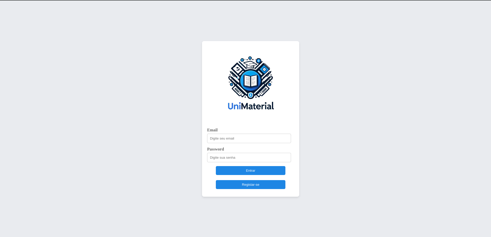

## 5.2 Pagina de registo

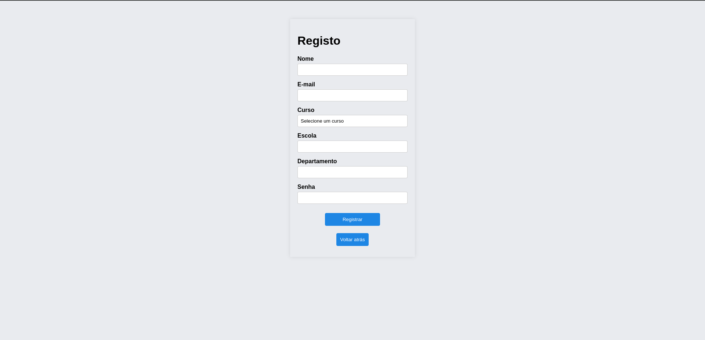

## 5.3 Página de notícias

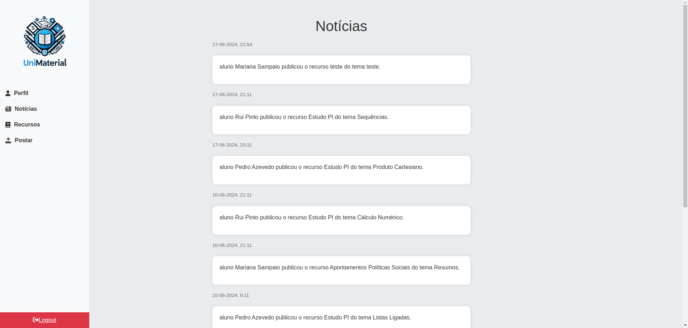


## 5.4 Página de recursos

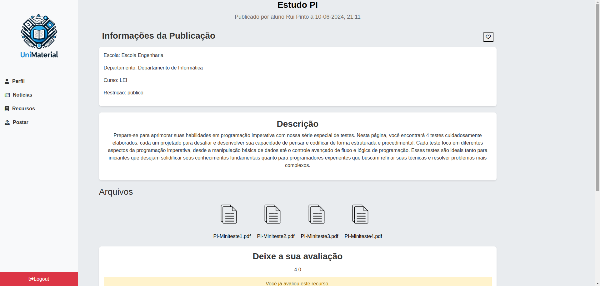

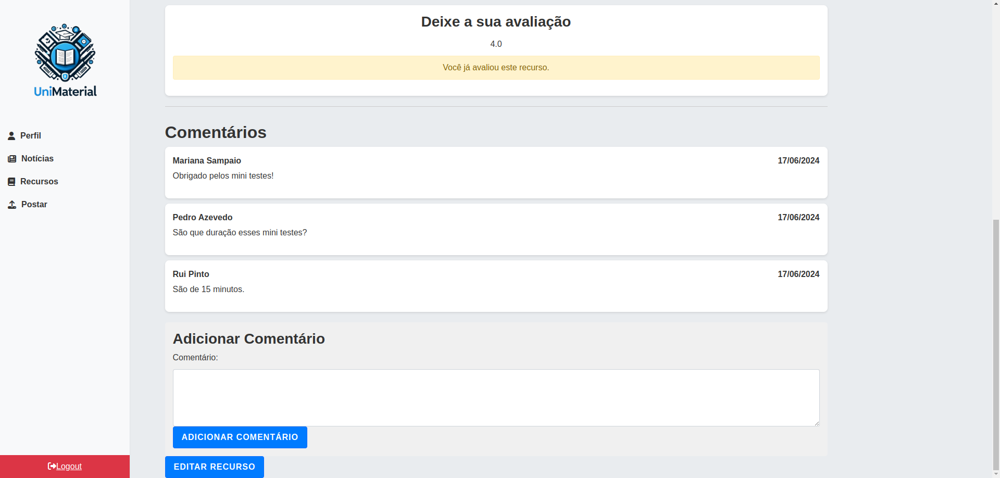

## 5.5 Página de publicação de um recurso

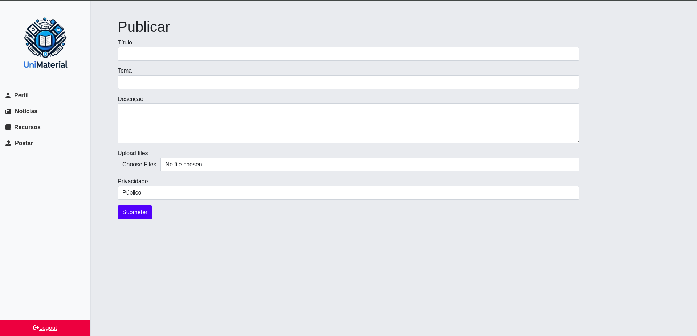

## 5.6 Página de edição de um recurso

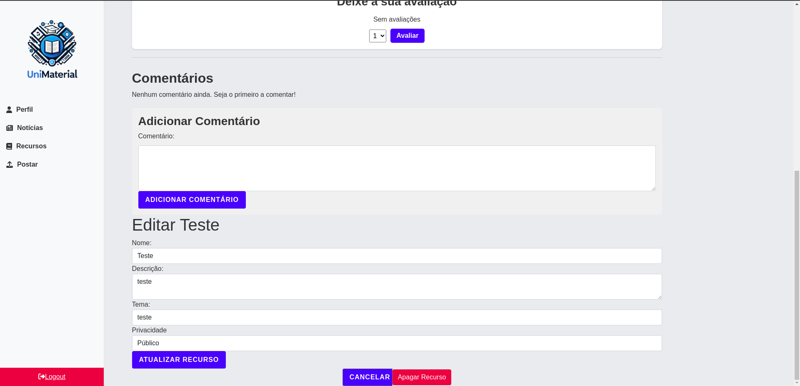

## 5.7 Página do painel do administrador

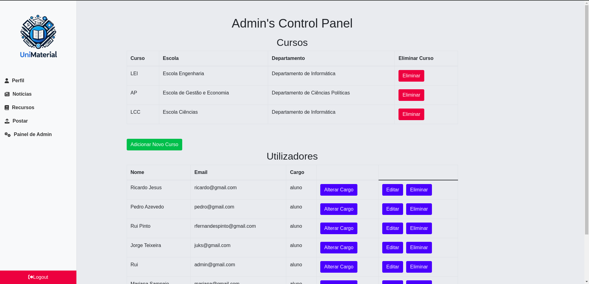

## 5.8 Página de perfil

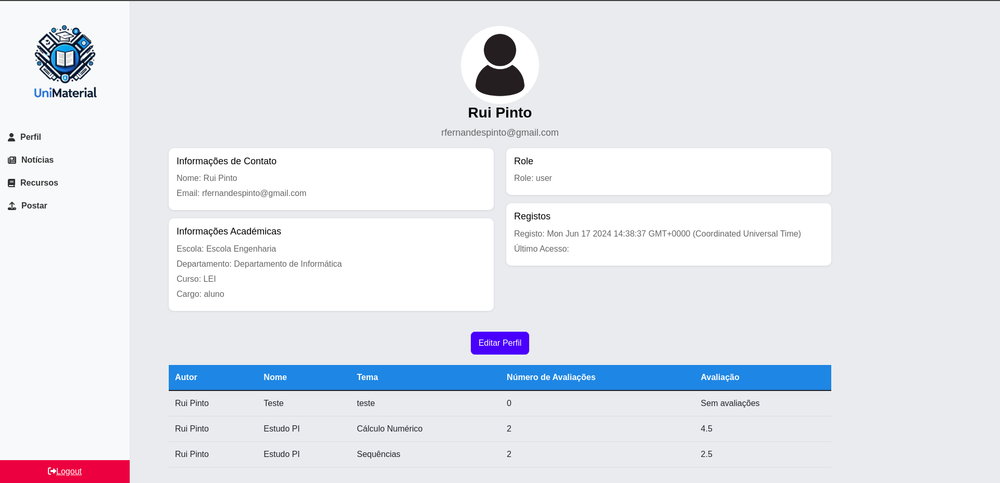

## 5.9 Página de edição de perfil

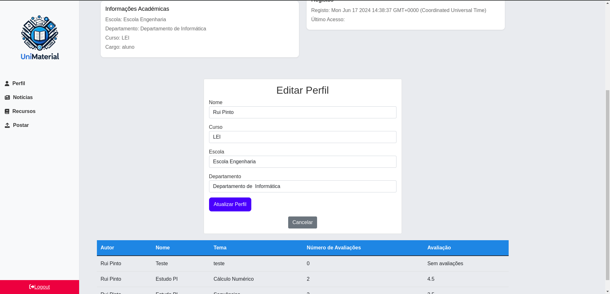

## 5.10 Recurso de edição da Página de recurso

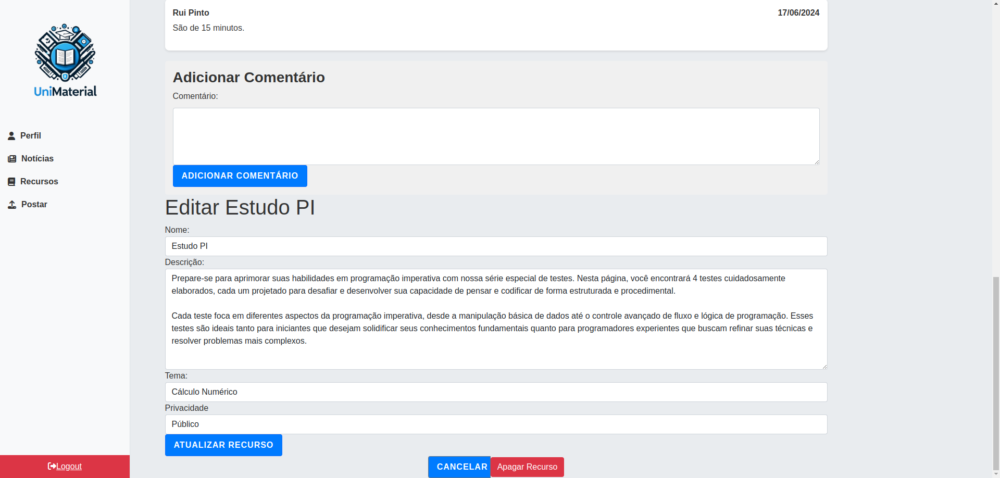

# 6. Modo de funcionamento 

Para correr o programa damos o comando ```sudo docker-compose down && sudo docker-compose up --build``` e o programa fica então a correr na porta 3000.

Se quisermos dar export dos dados usamos o comando ```sudo docker-compose up mongo-export``` o que exporta os dados para uma pasta `data/export`.

# 7. Conclusão

Em conclusão, finalizamos este projeto com uma plataforma funcional e que permite fazer todas as funcionalidades a que o grupo se propôs a implementar, tanto a nível de autenticação, níveis de acesso a recursos, entre outros. 

Para trabalhos futuros, existem sempre várias oportunidades e ideias que permitam uma expansão da plataforma. 

No geral, este projeto proporcionou uma oportunidade valiosa para aplicar os conhecimentos desenvolvidos ao longo do semestre durante as aulas teóricas e práticas desta unidade curricular, permitindo desenvolver uma plataforma completa.
